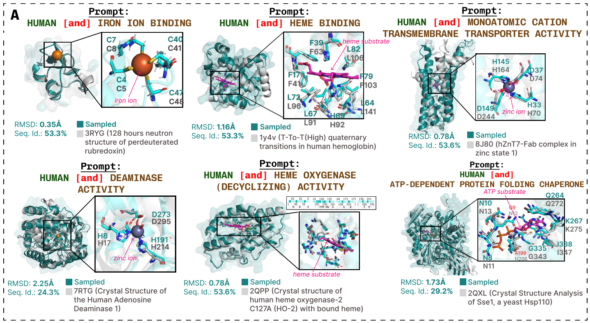

# PLAID (Protein Latent Induced Diffusion)



PLAID is a multimodal generative model that can generate protein sequence and all-atom structure based on conditional function and taxonomic prompts. Please see our [paper](https://www.biorxiv.org/content/10.1101/2024.12.02.626353v1) for more details.

### Key features:
* Unconditional sampling from PLAID
* Function- and organism-conditioned sampling with automatic length determination
* Training code for latent diffusion models
* Saving embeddings as a WebDataset loader for better I/O
* Evaluation pipeline for sequence/structure diversity and sequence/structure novelty, using `mmseqs` and `foldseek`
* Configurable pipelines using Hydra

## Contents

- [PLAID (Protein Latent Induced Diffusion)](#plaid-protein-latent-induced-diffusion)
    - [Key features:](#key-features)
  - [Contents](#contents)
  - [Demo](#demo)
  - [Installation](#installation)
    - [Clone the Repository](#clone-the-repository)
    - [Environment Setup](#environment-setup)
    - [Model Weights](#model-weights)
    - [Loading Pretrained Models](#loading-pretrained-models)
  - [Basic Usage](#basic-usage)
    - [Quick Start: Command line](#quick-start-command-line)
      - [Unconditional Sampling](#unconditional-sampling)
      - [Conditional Sampling](#conditional-sampling)
        - [Automatic length determination](#automatic-length-determination)
    - [Quick Start: Notebook](#quick-start-notebook)
  - [Full Pipeline](#full-pipeline)
      - [Step 1: Sampling Latent Embeddings](#step-1-sampling-latent-embeddings)
      - [Step 2: Decode the Latent Embedding](#step-2-decode-the-latent-embedding)
      - [Step 3: Generate inverse and phantom sequences/structures](#step-3-generate-inverse-and-phantom-sequencesstructures)
      - [Step 4: Analyze metrics (ccRMSD, novelty, diversity, etc.):](#step-4-analyze-metrics-ccrmsd-novelty-diversity-etc)
  - [Training](#training)
  - [License](#license)
  - [TODO (PRs welcome!)](#todo-prs-welcome)


## Demo

A hosted demo of the model will be available soon.


## Installation

### Clone the Repository

```bash
git clone https://github.com/amyxlu/plaid.git
cd plaid
```

### Environment Setup
Create the environment and install dependencies:

```bash
conda env create --file environment.yaml  # Create environment
pip install --no-deps git+https://github.com/amyxlu/openfold.git  # Install OpenFold
pip install -e .  # Install PLAID
```

Note: The OpenFold implementation of the ESMFold module includes custom CUDA kernels for the attention mechanism. This repository uses a fork of OpenFold with C++17 compatibility for CUDA kernels to support `torch >= 2.0`.


### Model Weights
* Latent Autoencoder (CHEAP): full codebase is available [here](https://github.com/amyxlu/cheap-proteins). We use the `CHEAP_pfam_shorten_2_dim_32()` model.
* Diffusion Weights (PLAID): Hosted on [HuggingFace](https://huggingface.co/amyxlu/plaid/tree/main). There is both a 2B and a 100M model.

By default, PLAID weights are cached in `~/.cache/plaid` and CHEAP latent autoencoder weights in `~/.cache/cheap`. Customize the cache path using:

```bash
echo "export CHEAP_CACHE=/path/to/cache" >> ~/.bashrc  # see CHEAP README for more details
echo "export PLAID_CACHE=/path/to/cache" >> ~/.bashrc
```

### Loading Pretrained Models

```python
from plaid.pretrained import PLAID_2B, PLAID_100M
denoiser, cfg = PLAID_2B()
```

This loads the PLAID DiT denoiser, and the hyperparameters used to initialize the diffusion object defined in `src/plaid/diffusion/cfg.py`.
The denoiser and diffusion configuration is loaded separately, since in theory, the denoiser can be used with any other diffusion setup, such as [EDM](https://github.com/lucidrains/edm-pytorch).
Using the sampling steps below will initialize the discrete diffusion process used in our paper.


## Basic Usage

The `run_pipeline.py` script offers an entry point to the full pipeline, which consists of:
1. Sampling latent embeddings.
2. Decoding these embeddings into sequences and structures.
3. Folding and inverse folding acrobatics to report self-consistency and cross-consistency statics.
4. Compute analysis metrics, including Foldseek and MMseqs to compare generations to known protein sequence and/or structure.

**Commands in this Basic Usage section will only run steps 1 & 2**. To run the full pipeline including evaluations, see the [Full Pipeline](#full-pipeline) and [Evaluation](#evaluation) sections.

>[!IMPORTANT]
>The specified length is half the actual protein length and must be divisible by 4. For example, to generate a 200-residue protein, set length=100.
### Quick Start: Command line

#### Unconditional Sampling

```bash
SAMPLE_OUTPUT_DIR=/shared/amyxlu/plaid/artifacts/samples
python pipeline/run_pipeline.py experiment=generate_unconditional ++sample.output_root_dir=$SAMPLE_OUTPUT_DIR ++sample.length=60 ++sample.num_samples=16
```

Note that `++sample.output_root_dir` has no default, and must be defined. Other defaults are defined in `configs/inference/sample/ddim_unconditional.yaml`.

This will save outputs to `SAMPLE_OUTPUT_DIR/f2219_o3617_l60_s3/`, where `f2219` refers to the unconditional function index, `o3617` refers to the unconditional organism index, and `l60` refers to the latent length.

#### Conditional Sampling
In this example, we're generating proteins with 6-phosphofructokinase activity from E. coli. 

```bash
SAMPLE_OUTPUT_DIR=/shared/amyxlu/plaid/artifacts/samples
python pipeline/run_pipeline.py experiment=generate_conditional ++sample.output_root_dir=$SAMPLE_OUTPUT_DIR ++sample.function_idx=166  ++sample.organism_idx=1030 ++sample.length=None ++sample.cond_scale=3.0
```

`++sample.function_idx` and `++sample.organism_idx` are required. Similar to the unconditional case, `++sample.output_root_dir` has no default, and must be defined. The other default values are this time specified in `configs/sample_conditional.yaml`.

The conditioning scale of 3.0 determines how strongly to condition - a scale of 0.0 would be equivalent to unconditional sampling.

This will save outputs to `SAMPLE_OUTPUT_DIR/f166_o1030_l140_s3/`, where `f166` refers to the conditional function index, `o1030` refers to the conditional organism index, and `s3` refers to the classifier-free guidance conditioning. `l140` is the auto-selected length. This might be different for different runs.

>[!TIP]
>To find the mapping between your desired GO term and function index, see `src/plaid/constants.py`.

##### Automatic length determination
If the function is specified, we can automatically choose a length to be **the length of a randomly sampled sequence from Pfam with that function**. This can be activated by setting `++sample.length=None`. 

### Quick Start: Notebook

You can also call the modular classes directly in a notebook, which affords some flexibilities; for example, here, we can specify the GO term and organism directly as a string. See the [conditional_demo.ipynb](notebooks/conditional_demo.ipynb) notebook for an example.

## Full Pipeline
The entire `pipeline/run_pipeline.py` script will run the full pipeline, including sampling, decoding, consistency, and analysis. See `configs/inference/full.yaml` for the full pipeline config.

You can also run each of these steps as individual scripts, if you need to resume from a pipeline step after an error. Scripts for each step are located in `pipeline`. These scripts are wrappers for the logic defined in `src/plaid/pipeline`.


#### Step 1: Sampling Latent Embeddings
1. Run latent sampling using Hydra-configured scripts in configs/pipeline/sample/. Example commands:

```bash
SAMPLE_OUTPUT_DIR=/shared/amyxlu/plaid/artifacts/samples

# Conditional sampling with inferred length
python pipeline/run_sample.py ++length=null ++function_idx=166 ++organism_idx=1326 ++sample.output_root_dir=$SAMPLE_OUTPUT_DIR`

# Conditional sampling with fixed length
python pipeline/run_sample.py ++length=200 ++function_idx=166 ++organism_idx=1326 ++sample.output_root_dir=$SAMPLE_OUTPUT_DIR`

# Unconditional sampling with specified output directory
python pipeline/run_sample.py ++length=200 ++function_idx=2219 ++organism_idx=3617 ++sample.output_root_dir=$SAMPLE_OUTPUT_DIR
```


>[!TIP]
>PLAID also supports the DPM++ sampler, which achieves comparable performance with fewer sampling steps. See `configs/inference/sample/dpm2m_sde.yaml` for more details.

#### Step 2: Decode the Latent Embedding
* 2a. Uncompress latent arrays using the CHEAP autoencoder.
* 2b. Use the CHEAP sequence decoder for sequences.
* 2c. Use the ESMFold structure encoder for structures.

```bash
python pipeline/run_pipeline.py experiment=generate_unconditional ++npz_path=$SAMPLE_OUTPUT_DIR/f2219_o3617_l60_s3/latent.npz
```

Note that the code in `++npz_path` depends on which specifications were used in Step 1, but this path always ends in `latent.npz`.

#### Step 3: Generate inverse and phantom sequences/structures

```bash
python pipeline/run_consistency.py ++samples_dir=/path/to/samples
```

#### Step 4: Analyze metrics (ccRMSD, novelty, diversity, etc.):

```bash
python pipeline/run_analysis.py /path/to/samples
```


## Training
Train PLAID models using PyTorch Lightning with distributed data parallel (DDP). Example launch command for training on 8 A100 GPUs:

```bash
python train_compositional.py  # see config/experiments
```

Key features:

* Min-SNR loss scaling
* Classifier-free guidance (GO terms and organisms)
* Self-conditioning
* EMA weight decay

Note: If using torch.compile, ensure precision is set to float32 due to compatibility issues with the xFormers library.

Embeddings are pre-computed and cached as `.tar` files for compatibility with [WebDataset](https://github.com/webdataset/webdataset) dataloaders. Pfam embedding `.tar` files used for training and validation data will be uploaded soon.

## License

PLAID is licensed under the MIT License. See the [LICENSE](LICENSE) file for details.

## TODO (PRs welcome!)
- [ ] Upload Pfam WebDataset embeddings
- [ ] Make a version of the repo that only loads the 100M model which does not require xFormers -- this will remove compatibility issues with new versions of PyTorch and remove the multiples-of-8 constraint on possible lengths we can use
